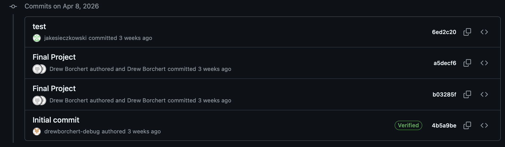
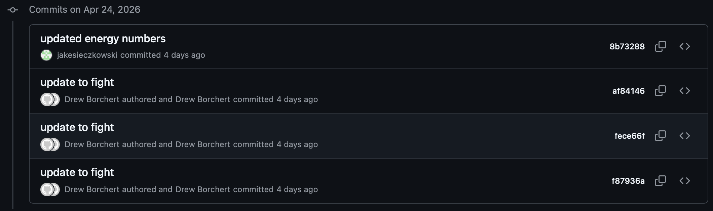
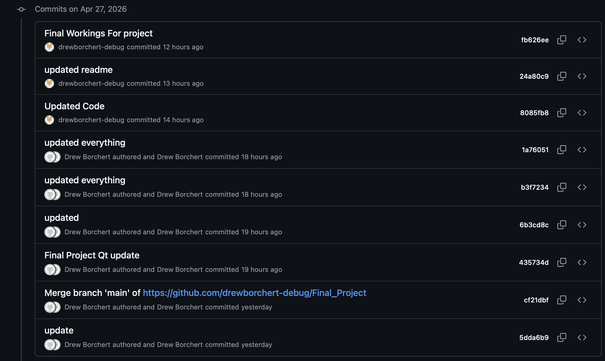
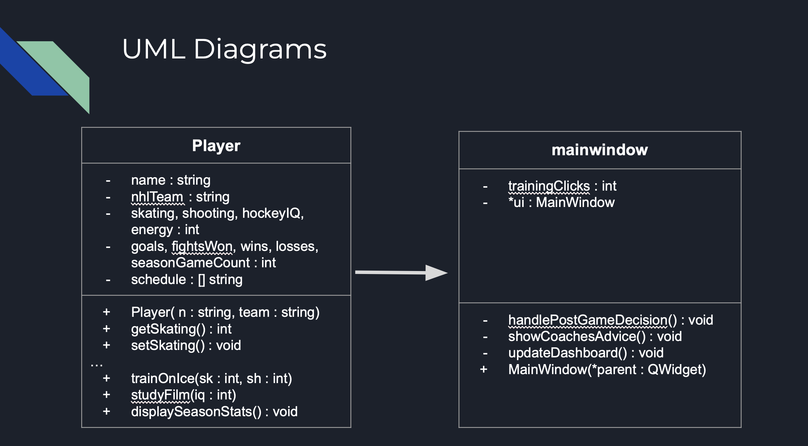
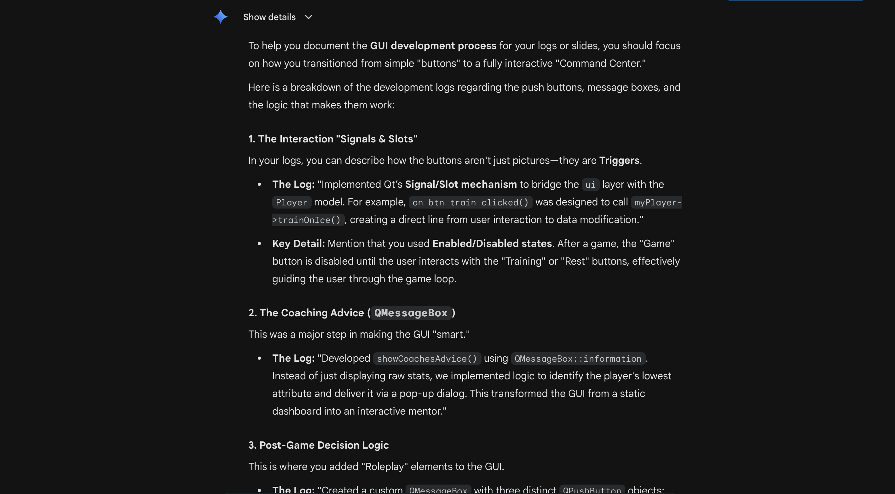
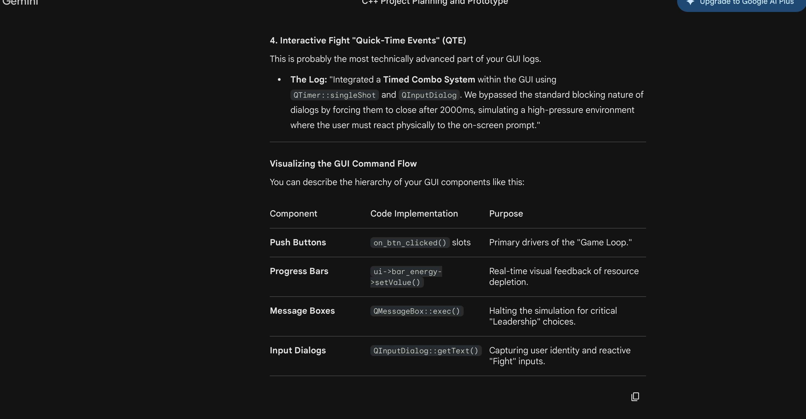
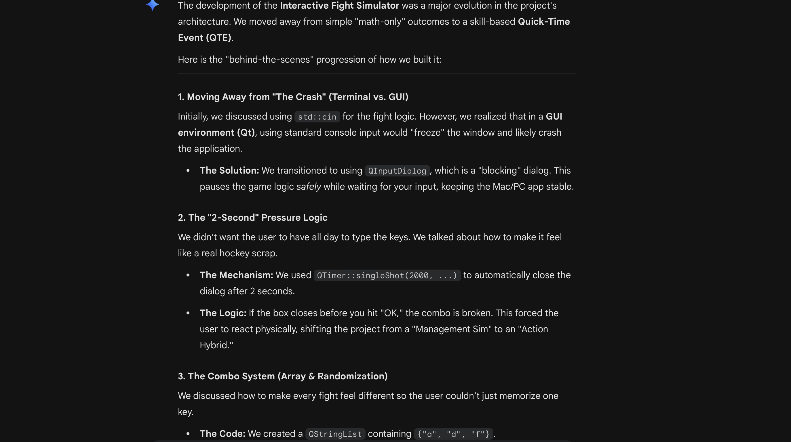
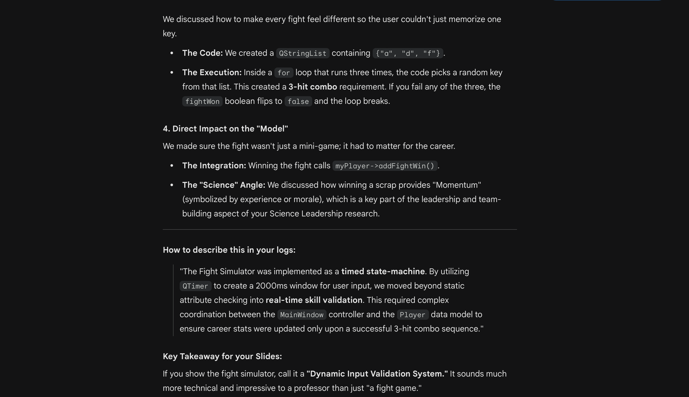

MyPlayer: Road to Championship  

A C++ Hockey Career Simulation & Data Dashboard

Partner: Andrew Borchert  

Partner: Jake Sieczkowski  

Class: Cmcs 240   

Date: April 28th 2026  

## Program Description
MyPlayer was developed to solve the "stagnant grind" found in many sports simulations. While traditional games focus solely on match play, our project emphasizes that elite performance is built away from the rink. By integrating a multi-faceted Decision System and Coaching Loop, we ensure that training, film study, and lifestyle choices are critical to player progression.

Core Feature Implementation (Project Requirements)

Match Simulation Engine: A weighted algorithm that calculates game outcomes based on player attributes (Skating, Shooting, Hockey IQ) rather than simple random chance.

Coaching System: An automated feedback loop where the "Coach" interprets post-game data to identify the player's weakest attribute and provide directed training suggestions.

Interactive Training System: A dashboard for "On-Ice" training and "Film Study" where users must balance attribute gains against a finite Energy Bar.

Branching Decision System: Post-game prompts offer "Active Choices" (Recovery vs. Social vs. Extra Work) with realistic trade-offs, such as gaining Hockey IQ at the cost of Physical Shooting stats.

Qt Dashboard (GUI): A custom graphical interface built with the Qt Framework, replacing terminal-based play with a visual dashboard featuring live stat counters and a dynamic 20-game season calendar.

## Change logs for overall project 
  
- Made the game accessable and run through VSCode, knowing what we have to do in advance.  
- April 15th, Started to work with QT Creator and GUI.  
  
- Has users test final project.   
  
- Final implenmentations and change to GUI from using QT Creator as final place to XQuartz as final spot where menu drops.  

## How to Compile and Run
This program uses a Graphical User Interface (GUI). If you are running this on a Mac or Windows machine via the University of Richmond CS Cluster, you must set up an X11 Server to allow the program window to appear on your local screen.

1. Prerequisites (External Software)

Before connecting to the cluster, ensure you have an X-Server installed:

Mac Users: Download and install XQuartz. Note: You must log out and log back into your Mac after installation for changes to take effect.

Windows Users: Download and install MobaXterm or VcXsrv.

2. Clone the Repository

Log into your environment (e.g., the Richmond CS Cluster via ssh -Y username@cs01.richmond.edu) and clone the project:  

git clone https://github.com/drewborchert-debug/Final_Project.git 
cd your-repo-name  

3. Build  

qmake -project  
echo "QT += widgets" >> Final_Project.pro  
qmake  
make  

Here you may have to switch terminals from using VSCode to your overall terminal on your device.  
Then log in again to ssh -Y username@cs01.richmond.edu  
cd to where the final project is located.  

4. Run (This may need a new terminal to reset)  
./Final_Project

## Final Reflections/Form
https://docs.google.com/spreadsheets/d/18Q88ZefCIAp-ocjvy6hfqj4OrM0voHLAn1QBl2aS1KU/edit?usp=sharing 

## UML Diagram

## Rescourse Logs

